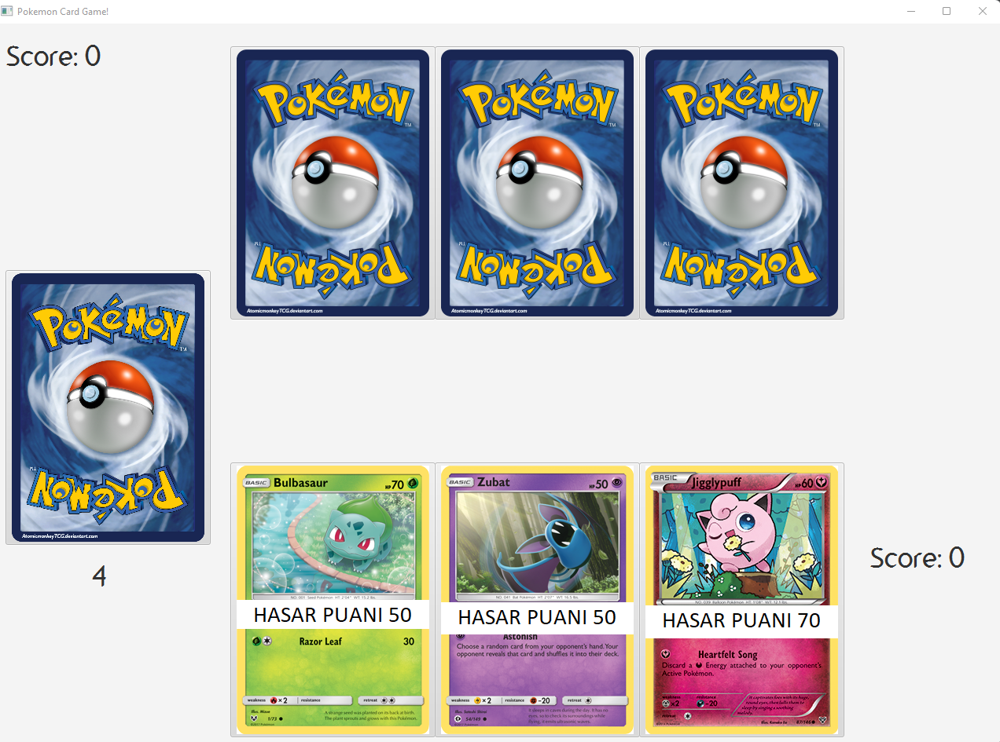
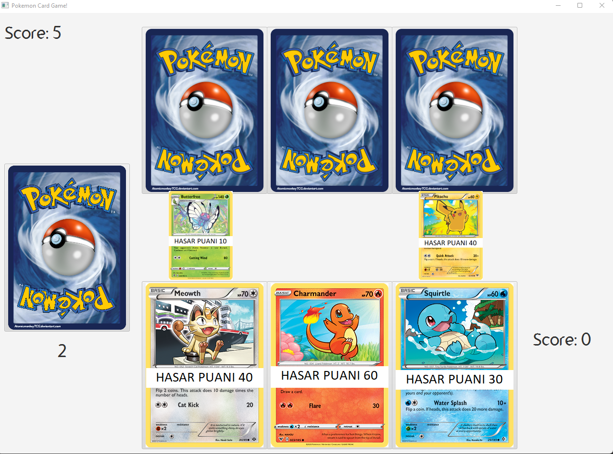

# PokemonCardGameJava
It is basic card game built with JavaFX, only included basic game mechanics. 
You duel againt computer (no AI just selects random card) 
Each player start the game with 3 cards on their hands. 
Select one of your hands and fight with the computer's card. 
2 card will be destroyed at the end of the turn. 
If you win the turn you will get 5 points likewise you lose 5 points. 
The game will keep going until all the cards are gone. 

